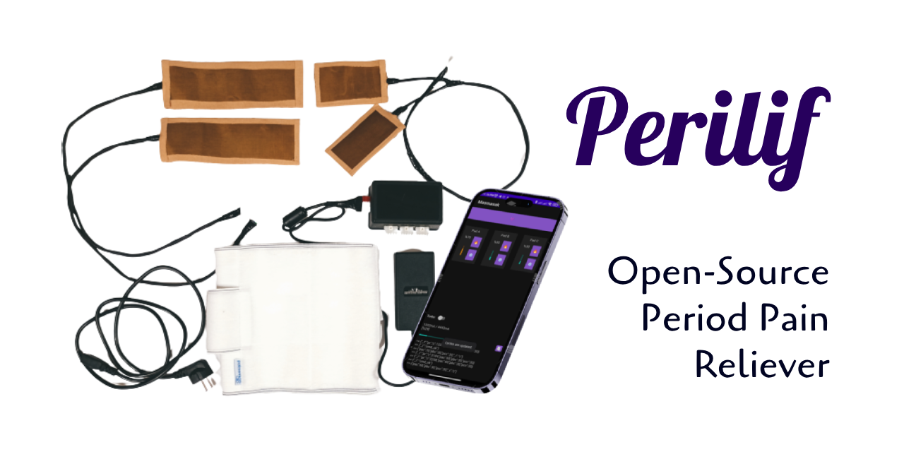

# 👨‍💻 Amirreza Nasiri

Hey there! I'm Amirreza Nasiri, a passionate **Software Developer**, **SRE** and **DevOps Engineer** with hands-on experience in designing, implementing, and maintaining complex infrastructure on-premises systems. I love automating processes, optimizing systems, and ensuring high availability for mission-critical applications.

## Projects

### 🪱 Kermoo

### 💰 Laravel Toman

### 🌸 Perilif

### 🗂 Vue Modern Resume

### ☠️ USB Keystroke Injector

### 🍀 Laraberg Vue

### 🍀 Vue Registrar

## 🍀 Skills
| Topic | Things |
|-|-|
| 💼 Communications |    
| 💼 Project Management |   
| 🏗️ Infrastructure |     
| 🏗️ Orchestration |    
| 🌠Networking |  
| 🛡️ Security & IAM |  
| ⤵️ Ingress |    
| 🔭 Observibility |      
| 🤖 Automation |     
| 💻 Programming |      
| 📚 Data |          
| 💾 File Storage | -05122A?style=flat&logo=ceph) 

## 🤝🏻 Connect with me

